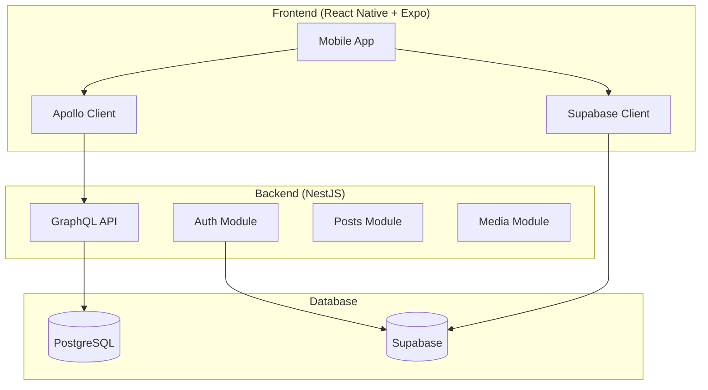
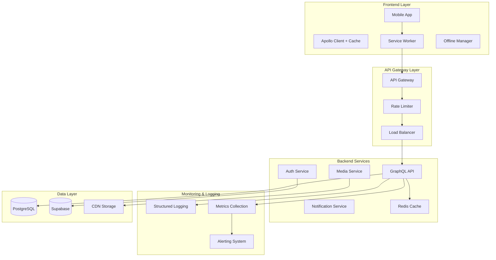

# SportComm 프로젝트 개선사항 설계 문서

## 개요

SportComm 프로젝트의 현재 상태 분석을 바탕으로, 시스템의 안정성, 성능, 보안, 유지보수성을 향상시키기 위한 종합적인 개선 방안을 설계합니다. 이 문서는 백엔드와 프론트엔드 모두를 아우르는 전체적인 아키텍처 개선 방향을 제시합니다.

## 아키텍처

### 현재 아키텍처 분석



### 개선된 아키텍처



## 컴포넌트 및 인터페이스

### 1. 백엔드 보안 및 미들웨어 개선

#### 보안 미들웨어 스택

```typescript
interface SecurityMiddleware {
  helmet: HelmetOptions;
  cors: CorsOptions;
  rateLimit: RateLimitOptions;
  validation: ValidationOptions;
}

interface HelmetOptions {
  contentSecurityPolicy: CSPDirectives;
  hsts: HSTSOptions;
  noSniff: boolean;
  xssFilter: boolean;
}
```

#### API 보안 설정

```typescript
interface APISecurityConfig {
  queryComplexity: {
    maximumComplexity: number;
    maximumDepth: number;
    scalarCost: number;
    objectCost: number;
  };
  rateLimiting: {
    windowMs: number;
    max: number;
    skipSuccessfulRequests: boolean;
  };
  authentication: {
    jwtSecret: string;
    tokenExpiry: string;
    refreshTokenExpiry: string;
  };
}
```

### 2. 프론트엔드 성능 최적화

#### 이미지 최적화 시스템

```typescript
interface ImageOptimizationConfig {
  formats: ["webp", "avif", "jpeg"];
  sizes: {
    thumbnail: { width: 150; height: 150 };
    medium: { width: 500; height: 500 };
    large: { width: 1200; height: 1200 };
  };
  quality: {
    webp: 80;
    avif: 70;
    jpeg: 85;
  };
  caching: {
    maxAge: number;
    staleWhileRevalidate: number;
  };
}
```

#### 오프라인 지원 시스템

```typescript
interface OfflineManager {
  cacheStrategy: CacheStrategy;
  syncQueue: SyncQueue;
  conflictResolution: ConflictResolver;
}

interface CacheStrategy {
  posts: "cache-first" | "network-first";
  media: "cache-only";
  user: "network-first";
}
```

### 3. 상태 관리 개선

#### 전역 상태 아키텍처

```typescript
interface AppState {
  auth: AuthState;
  posts: PostsState;
  ui: UIState;
  offline: OfflineState;
}

interface AuthState {
  user: User | null;
  token: string | null;
  isAuthenticated: boolean;
  syncStatus: "idle" | "syncing" | "error";
}
```

## 데이터 모델

### 1. 개선된 엔티티 구조

#### User 엔티티 최적화

```typescript
@Entity("users")
@Index(["email"], { unique: true })
@Index(["nickname"], { unique: true })
@Index(["createdAt"])
export class User extends BaseEntity {
  // 기존 필드 유지 + 추가 필드

  @Column({ type: "jsonb", nullable: true })
  preferences: UserPreferences;

  @Column({ type: "timestamp", nullable: true })
  lastActiveAt: Date;

  @Column({ type: "inet", nullable: true })
  lastLoginIp: string;
}

interface UserPreferences {
  theme: "light" | "dark" | "auto";
  notifications: NotificationSettings;
  privacy: PrivacySettings;
}
```

#### 성능 최적화를 위한 인덱스 전략

```sql
-- 복합 인덱스 추가
CREATE INDEX CONCURRENTLY idx_posts_author_created
ON posts(author_id, created_at DESC);

CREATE INDEX CONCURRENTLY idx_posts_team_type_created
ON posts(team_id, type, created_at DESC);

-- 부분 인덱스 추가
CREATE INDEX CONCURRENTLY idx_posts_active
ON posts(created_at DESC)
WHERE is_active = true AND is_public = true;
```

### 2. 캐싱 전략

#### Redis 캐시 구조

```typescript
interface CacheStrategy {
  posts: {
    key: "posts:feed:{userId}:{page}";
    ttl: 300; // 5분
    invalidation: ["post:created", "post:updated", "post:deleted"];
  };
  user: {
    key: "user:{userId}";
    ttl: 3600; // 1시간
    invalidation: ["user:updated"];
  };
  media: {
    key: "media:{mediaId}";
    ttl: 86400; // 24시간
    invalidation: ["media:updated"];
  };
}
```

## 에러 처리

### 1. 구조화된 에러 시스템

#### 에러 타입 정의

```typescript
enum ErrorCode {
  // Authentication
  AUTH_TOKEN_EXPIRED = "AUTH_001",
  AUTH_INVALID_CREDENTIALS = "AUTH_002",
  AUTH_INSUFFICIENT_PERMISSIONS = "AUTH_003",

  // Validation
  VALIDATION_REQUIRED_FIELD = "VAL_001",
  VALIDATION_INVALID_FORMAT = "VAL_002",
  VALIDATION_OUT_OF_RANGE = "VAL_003",

  // Business Logic
  POST_NOT_FOUND = "POST_001",
  POST_ALREADY_LIKED = "POST_002",
  USER_BLOCKED = "USER_001",

  // System
  DATABASE_CONNECTION_ERROR = "SYS_001",
  EXTERNAL_SERVICE_ERROR = "SYS_002",
}

interface AppError {
  code: ErrorCode;
  message: string;
  details?: Record<string, any>;
  timestamp: Date;
  requestId: string;
  userId?: string;
}
```

#### 에러 처리 미들웨어

```typescript
@Injectable()
export class GlobalExceptionFilter implements ExceptionFilter {
  catch(exception: unknown, host: ArgumentsHost) {
    const ctx = host.switchToHttp();
    const response = ctx.getResponse();
    const request = ctx.getRequest();

    const error = this.normalizeError(exception);

    // 로깅
    this.logger.error("Application Error", {
      error,
      request: {
        method: request.method,
        url: request.url,
        userAgent: request.headers["user-agent"],
        userId: request.user?.id,
      },
    });

    // 클라이언트 응답
    response.status(error.statusCode).json({
      success: false,
      error: {
        code: error.code,
        message: error.message,
        ...(process.env.NODE_ENV === "development" && {
          details: error.details,
        }),
      },
      timestamp: new Date().toISOString(),
      requestId: request.id,
    });
  }
}
```

### 2. 프론트엔드 에러 처리

#### 에러 바운더리 시스템

```typescript
interface ErrorBoundaryState {
  hasError: boolean;
  error: Error | null;
  errorInfo: ErrorInfo | null;
  errorId: string;
}

class AppErrorBoundary extends Component<Props, ErrorBoundaryState> {
  static getDerivedStateFromError(error: Error): Partial<ErrorBoundaryState> {
    return {
      hasError: true,
      error,
      errorId: generateErrorId(),
    };
  }

  componentDidCatch(error: Error, errorInfo: ErrorInfo) {
    // 에러 리포팅 서비스로 전송
    this.reportError(error, errorInfo);
  }
}
```

## 테스트 전략

### 1. 백엔드 테스트 구조

#### 테스트 피라미드

```typescript
// 단위 테스트 (70%)
describe("PostService", () => {
  describe("createPost", () => {
    it("should create post with valid data", async () => {
      // Given
      const createPostDto = { title: "Test", content: "Content" };

      // When
      const result = await postService.createPost(createPostDto);

      // Then
      expect(result).toBeDefined();
      expect(result.title).toBe("Test");
    });
  });
});

// 통합 테스트 (20%)
describe("Posts API Integration", () => {
  it("should create and retrieve post", async () => {
    const response = await request(app)
      .post("/graphql")
      .send({ query: CREATE_POST_MUTATION })
      .expect(200);

    expect(response.body.data.createPost).toBeDefined();
  });
});

// E2E 테스트 (10%)
describe("Post Creation Flow", () => {
  it("should allow authenticated user to create post", async () => {
    await loginUser();
    await createPost();
    await verifyPostExists();
  });
});
```

### 2. 프론트엔드 테스트 구조

#### 컴포넌트 테스트

```typescript
describe('PostCard Component', () => {
  it('should render post data correctly', () => {
    const mockPost = createMockPost();

    render(<PostCard post={mockPost} />);

    expect(screen.getByText(mockPost.title)).toBeInTheDocument();
    expect(screen.getByText(mockPost.content)).toBeInTheDocument();
  });

  it('should handle like action', async () => {
    const mockPost = createMockPost();
    const onLike = jest.fn();

    render(<PostCard post={mockPost} onLike={onLike} />);

    fireEvent.press(screen.getByTestId('like-button'));

    expect(onLike).toHaveBeenCalledWith(mockPost.id);
  });
});
```

## 모니터링 및 로깅

### 1. 구조화된 로깅 시스템

#### 로그 구조

```typescript
interface LogEntry {
  timestamp: string;
  level: "debug" | "info" | "warn" | "error";
  message: string;
  context: string;
  metadata: {
    requestId?: string;
    userId?: string;
    operation?: string;
    duration?: number;
    [key: string]: any;
  };
}

// 사용 예시
logger.info("Post created successfully", {
  context: "PostService",
  metadata: {
    postId: post.id,
    authorId: post.authorId,
    duration: Date.now() - startTime,
  },
});
```

### 2. 메트릭 수집

#### 핵심 메트릭

```typescript
interface ApplicationMetrics {
  // 성능 메트릭
  responseTime: {
    p50: number;
    p95: number;
    p99: number;
  };

  // 비즈니스 메트릭
  postsCreated: number;
  activeUsers: number;
  errorRate: number;

  // 시스템 메트릭
  memoryUsage: number;
  cpuUsage: number;
  databaseConnections: number;
}
```

### 3. 알림 시스템

#### 알림 규칙

```typescript
interface AlertRule {
  name: string;
  condition: string;
  threshold: number;
  duration: string;
  severity: "low" | "medium" | "high" | "critical";
  channels: ("email" | "slack" | "sms")[];
}

const alertRules: AlertRule[] = [
  {
    name: "High Error Rate",
    condition: "error_rate > threshold",
    threshold: 0.05, // 5%
    duration: "5m",
    severity: "high",
    channels: ["email", "slack"],
  },
  {
    name: "Database Connection Pool Exhausted",
    condition: "db_connections_used / db_connections_max > threshold",
    threshold: 0.9, // 90%
    duration: "2m",
    severity: "critical",
    channels: ["email", "slack", "sms"],
  },
];
```

## 보안 강화

### 1. 인증 및 권한 관리

#### JWT 토큰 관리

```typescript
interface TokenManager {
  generateTokens(user: User): Promise<TokenPair>;
  refreshToken(refreshToken: string): Promise<TokenPair>;
  revokeToken(token: string): Promise<void>;
  validateToken(token: string): Promise<TokenPayload>;
}

interface TokenPair {
  accessToken: string;
  refreshToken: string;
  expiresIn: number;
}
```

#### 권한 기반 접근 제어

```typescript
@Injectable()
export class RBACGuard implements CanActivate {
  canActivate(context: ExecutionContext): boolean {
    const requiredPermissions = this.reflector.get<Permission[]>(
      "permissions",
      context.getHandler()
    );

    const user = context.switchToHttp().getRequest().user;

    return this.hasPermissions(user, requiredPermissions);
  }
}
```

### 2. 입력 검증 및 새니타이제이션

#### 검증 파이프라인

```typescript
@Injectable()
export class ValidationPipe implements PipeTransform {
  transform(value: any, metadata: ArgumentMetadata) {
    // 1. 스키마 검증
    const validatedValue = this.validateSchema(value, metadata);

    // 2. 새니타이제이션
    const sanitizedValue = this.sanitize(validatedValue);

    // 3. 비즈니스 규칙 검증
    const businessValidatedValue = this.validateBusinessRules(sanitizedValue);

    return businessValidatedValue;
  }
}
```

## 성능 최적화

### 1. 데이터베이스 최적화

#### 쿼리 최적화 전략

```typescript
// N+1 문제 해결
@Resolver(() => Post)
export class PostResolver {
  @ResolveField(() => User)
  async author(@Parent() post: Post, @Loader(UserLoader) userLoader: DataLoader<string, User>) {
    return userLoader.load(post.authorId);
  }
}

// 페이지네이션 최적화
async findPosts(options: FindPostsOptions): Promise<PaginatedPosts> {
  const query = this.postRepository
    .createQueryBuilder('post')
    .leftJoinAndSelect('post.author', 'author')
    .where('post.isActive = :isActive', { isActive: true })
    .orderBy('post.createdAt', 'DESC');

  // 커서 기반 페이지네이션
  if (options.cursor) {
    query.andWhere('post.createdAt < :cursor', { cursor: options.cursor });
  }

  return query.take(options.limit).getMany();
}
```

### 2. 캐싱 전략

#### 다층 캐싱 시스템

```typescript
@Injectable()
export class CacheService {
  // L1: 메모리 캐시 (빠른 접근)
  private memoryCache = new Map<string, CacheEntry>();

  // L2: Redis 캐시 (분산 캐시)
  constructor(private redis: Redis) {}

  async get<T>(key: string): Promise<T | null> {
    // L1 캐시 확인
    const memoryEntry = this.memoryCache.get(key);
    if (memoryEntry && !this.isExpired(memoryEntry)) {
      return memoryEntry.value;
    }

    // L2 캐시 확인
    const redisValue = await this.redis.get(key);
    if (redisValue) {
      const value = JSON.parse(redisValue);
      this.memoryCache.set(key, { value, expiry: Date.now() + 60000 });
      return value;
    }

    return null;
  }
}
```

## 배포 및 운영

### 1. CI/CD 파이프라인

#### 배포 전략

```yaml
# .github/workflows/deploy.yml
name: Deploy to Production

on:
  push:
    branches: [main]

jobs:
  test:
    runs-on: ubuntu-latest
    steps:
      - uses: actions/checkout@v3
      - name: Run Tests
        run: |
          npm ci
          npm run test:unit
          npm run test:integration
          npm run test:e2e

  security-scan:
    runs-on: ubuntu-latest
    steps:
      - name: Security Audit
        run: npm audit --audit-level high

  deploy:
    needs: [test, security-scan]
    runs-on: ubuntu-latest
    steps:
      - name: Deploy to Production
        run: |
          # Blue-Green 배포
          ./scripts/deploy.sh
```

### 2. 환경 관리

#### 환경별 설정

```typescript
interface EnvironmentConfig {
  database: {
    host: string;
    port: number;
    ssl: boolean;
    poolSize: number;
  };
  redis: {
    host: string;
    port: number;
    cluster: boolean;
  };
  logging: {
    level: string;
    structured: boolean;
  };
  security: {
    corsOrigins: string[];
    rateLimits: RateLimitConfig;
  };
}
```

이 설계 문서는 SportComm 프로젝트의 전반적인 개선 방향을 제시하며, 각 컴포넌트별로 구체적인 구현 방안을 포함하고 있습니다. 다음 단계에서는 이를 바탕으로 실행 가능한 태스크 목록을 작성하겠습니다.
